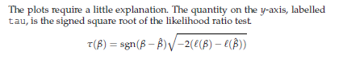

#### 13.2 Logistic regression on tabular data

In this section, we analyze the example concerning hypertension from
Altman (1991, p. 353). First, we need to enter data, which is done as
follows

```{r}

no.yes <- c("No","Yes")
smoking <- gl(2,1,8,no.yes)
obesity <- gl(2,2,8,no.yes)
snoring <- gl(2,4,8,no.yes)
n.tot <- c(60,17,8,2,187,85,51,23)
n.hyp <- c(5,2,1,0,35,13,15,8)
data.frame(smoking,obesity,snoring,n.tot,n.hyp)


```

```{r}
hyp.tbl <- cbind(n.hyp,n.tot-n.hyp)
hyp.tbl
```

Then, you can specify the logistic regression model as

```{r}

glm(hyp.tbl ~ smoking+obesity+snoring,family=binomial("logit"))

```

Actually, "logit" is the default for binomial and the family argument
is the second argument to glm, so it suffices to write

```{r}

glm(hyp.tbl~smoking+obesity+snoring,binomial)

```

The other way to specify a logistic regression model is to give the
proportion of diseased in each cell:

```{r}

prop.hyp <- n.hyp/n.tot
glm.hyp <- glm(prop.hyp~smoking+obesity+snoring,binomial,weights=n.tot)
glm.hyp

```

```{r}

glm.hyp <- glm(hyp.tbl~smoking+obesity+snoring,binomial)
summary(glm.hyp)

```
```{r}

summary(glm.hyp, corr = T)

```
The z test in the table of regression coefficients immediately shows that
the model can be simplified by removing smoking. The result then looks
as follows (abbreviated):

```{r}

glm.hyp <- glm(hyp.tbl~obesity+snoring,binomial)
summary(glm.hyp)

```
#### 13.2.1 The analysis of deviance table

Notice that the Deviance column gives differences between models as
variables are added to the model in turn. The deviances are approximately
χ2-distributed with the stated degrees of freedom. It is necessary to add
the test="chisq" argument to get the approximate χ2 tests.

```{r}
glm.hyp <- glm(hyp.tbl~smoking+obesity+snoring,binomial)
anova(glm.hyp, test="Chisq")


```

Since the snoring variable on the last line is significant, it may not be
removed from the model and we cannot use the table to justify model
reductions. If, however, the terms are rearranged so that smoking comes
last, we get a deviance-based test for removal of that variable:

```{r}
glm.hyp <- glm(hyp.tbl~snoring+obesity+smoking,binomial)
anova(glm.hyp, test="Chisq")
```

From this you can read that smoking is removable, whereas obesity is
not, after removal of smoking.

```{r}

glm.hyp <- glm(hyp.tbl~obesity+snoring,binomial)
anova(glm.hyp, test="Chisq")

```

An alternative method is to use drop1 to try removing one term at a time:

```{r}
glm.hyp <- glm(hyp.tbl~obesity+snoring,binomial)
anova(glm.hyp, test="Chisq")
```

```{r}
drop1(glm.hyp, test="Chisq")
```

#### 13.3 Likelihood profiling

the MASS package allows you to compute intervals
that are based on inverting the likelihood ratio test. In practice, this
works like this

```{r}
confint(glm.hyp)
```
The standard type of result can be obtained using confint.default.
The difference in this case is not very large, although visible in the lines
relating to snoring and the intercept:
```{r}
confint.default(glm.hyp)
```
The way this works is via likelihood profiling. For a set of trial values of the
parameter, the likelihood is maximized over the other parameters in the
model. The result can be displayed in a profile plot as follows:

```{r}

```

```{r}
library(MASS)
plot(profile(glm.hyp))
```
#### 13.4 Presentation as odds-ratio estimates

This means odds ratio per unit change in the
covariate. That is, the antilogarithm (exp) of the regression coefficients is
given instead of the coefficients themselves. Since standard errors make
little sense after the transformation, it is also customary to give confidence
intervals instead. This can be obtained quite easily as follows:

```{r}
exp(cbind(OR=coef(glm.hyp), confint(glm.hyp)))
```

#### 13.6 Prediction

The predict function works for generalized linear models, too. Let us
first consider the hypertension example, where data were given in tabular
form:

```{r}

predict(glm.hyp)

```

To get predicted values on the response scale (i.e., probabilities), use the
type="response" argument to predict

```{r}
predict(glm.hyp, type="response")
```


#### 13.7 Model checking

For tabular data it is obvious to try to compare observed and fitted
proportions. In the hypertension example you get

```{r}
fitted(glm.hyp)
```

```{r}

prop.hyp <- n.hyp/n.tot
prop.hyp

```
The problem with this is that you get no feeling for how well the relative
frequencies are determined. It can be better to look at observed and
expected counts instead. The former can be computed as
```{r}
fitted(glm.hyp)*n.tot
```

```{r}
data.frame(fit=fitted(glm.hyp)*n.tot,n.hyp,n.tot)
```

