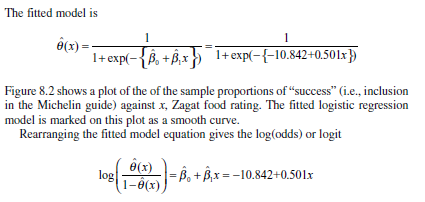
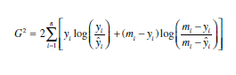
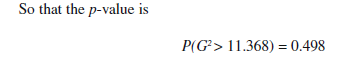
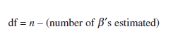
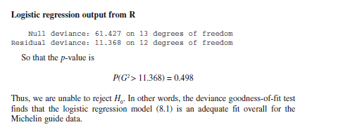
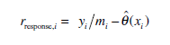
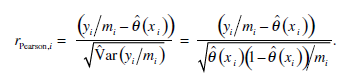
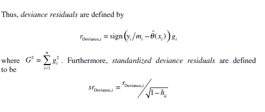

```{r}
michelin <- read.table("michelin.csv", header=T,sep=";")
attach(michelin)

```

```{r}
head(michelin)
```

```{r}
plot(FoodRatingXi,YiMi)

```

#### 8.1.1 Logistic regresion output from R

```{r}
Michelin.food <- glm(cbind(InMichelinYi,MiYi) ~ FoodRatingXi, family = binomial)

```


```{r}
summary(Michelin.food)
```

```{r}



```
#### 8.1.2 Likelihood for Logistic Regression with a Single Predictor

We next look at how likelihood can be used to estimate the parameters in logistic
regression.

```{r}
Theta_X <- 1/(1+exp(-(-10.84154+0.50124*FoodRatingXi)))

plot(FoodRatingXi,YiMi,  ylab = "Probability to be included on Michelin Guide")
par(new=TRUE)
plot(Theta_X, type = "l"  ,col="red", xlab = "", ylab = "", axes = F)

```
Table 8.2 Estimated probabilities and odds obtained from the logistic model
```{r}
estimated_probability <- Theta_X
estimated_odds <- Theta_X/(1-Theta_X)

estimated_table <- cbind(FoodRatingXi, estimated_probability, estimated_odds)
estimated_table <- round(estimated_table, 3)
estimated_table
```
LogLikehood
```{r}

LL_Food <- log(Theta_X)
LL_Food

```


Falta mirar walt test

In logistic regression the concept of the residual sum of squares is replaced by a concept known as the deviance . In the case of logistic regression the deviance is defined to be

#### 8.1.3 Explanation of Deviance

In logistic regression the concept of the residual sum of squares is replaced by aconcept known as the deviance . In the case of logistic regression the deviance is defined to be

```{r}

```

```{r}
G2 <- 2*sum(YiMi * log(YiMi/Theta_X) + MiYi * log(MiYi/(Mi - Theta_X)));
G2
```
good model when 
```{r}



```


```{r}

```

```{r}

DF <- nrow(michelin) - 2

```

the deviance is given by twice the difference between these maximized log-likelihoods.

```{r}
summary(Michelin.food)

```
#### 8.1.4 Using Differences in Deviance Values to Compare Models

The difference in deviance can be used to compare nested models. For example, we can compare the null and residual deviances to test

H0 : logistic regression model  is appropriate against
HA : logistic model is inappropriate so a saturated model is needed

```{r}

n <- 14
p <- 1

Deviance_null <- 61.427
Deviance_Food <- 11.368

DevianceCompared <- Deviance_null - Deviance_Food;DevianceCompared

DOF <- n - p - 1
  
#### NO DA REVISAR

dchisq(DevianceCompared, df = DOF)

```

# 8.1.5 R2 for Logistic Regression

Jummm

# 8.1.6 Residuals for Logistic Regression

```{r}

```
```{r}
knitr::include_graphics("rresponse_FIX.PNG")
```


```{r}
# TX <- c(0.025, 0.042, 0.069, 0.111, 0.175, 0.265, 0.38, 0.509, 0.638, 0.75, 0.836, 0.896, 0.936, 0.961)
Response_residuals <- (InMichelinYi / Mi) - Theta_X
Response_residuals
```


```{r}

```
residuals pearson

```{r}
## rr <- c(-0.035, -0.056, -0.089, -0.006, 0.067, -0.064, 0.155, -0.213, 0.001, 0.091, 0.073, -0.399, -0.079, 0.039 )
rpearson <- Response_residuals/sqrt(Theta_X*(( 1 - Theta_X )/ Mi))
rpearson
```

residuals deviance

```{r}

```

```{r}
####### jum
```

